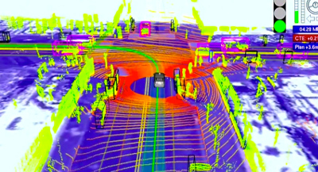
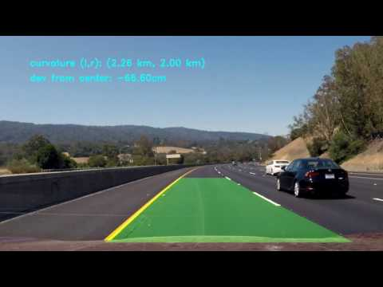

Всем привет!

Это пост-отчет-тьюториал про беспилотные автомобили - как (начать) делать свой.
Весь код доступен [на github](https://github.com/waiwnf/pilotguru). Поехали!

## Вкратце

Краткое содержание для знакомых с темой: традиционно для набора
[обучающей выборки](https://medium.com/udacity/open-sourcing-223gb-of-mountain-view-driving-data-f6b5593fbfa5) 
для автопилота на основе машинного обучения нужен был 
[специально оборудованный автомобиль](https://medium.com/udacity/were-building-an-open-source-self-driving-car-ac3e973cd163) 
с [достаточно информативной CAN шиной](http://blog.caranddriver.com/why-ford-lincoln-and-lexus-testers-rule-the-self-driving-roost/)
и интерфейсом к ней. В этом проекте мы
будем набирать такие же по сути данные просто со смартфона на лобовом стекле.
Подходит любой авто, никаких модификаций оборудования. В этой серии - вычисляем
поворот руля в каждый момент времени по видео. Если в этом абзаце всё понятно,
можно перепрыгивать через введение [сразу к сути подхода](#problem-setting).

## Что-зачем-почему более подробно

Итак, ещё пару лет назад без серьёзных ресурсов большой корпорации в тему
автопилотов было не 
сунуться - один только [LIDAR](https://ru.wikipedia.org/wiki/%D0%9B%D0%B8%D0%B4%D0%B0%D1%80)
сенсор стоил 
[десятки тысяч долларов](http://content.usatoday.com/communities/driveon/post/2012/06/google-discloses-costs-of-its-driverless-car-tests/1#.WOEJhnWGNpg), но недавняя 
революция в нейросетях всё изменила. 
[Стартапы из нескольких человек](http://comma.ai/) с 
простейшими наборами сенсоров из пары вебкамер на равных 
[конкурируют по качеству результата](http://newatlas.com/geohot-comma-ai-openpilot-open-source/46722/)
со знаменитыми брендами. Почему бы не попробовать и нам, тем более
столько качественных [компонентов](https://github.com/commaai/openpilot)
уже в [открытом](https://github.com/udacity/self-driving-car/tree/master/steering-models/community-models)
[доступе](https://github.com/commaai/neo).

Автопилот преобразует данные сенсоров в управляющие воздействия - поворот руля и
требуемое  ускорение/замедление. В системе с лазерными дальномерами, как у Google,
это может выглядеть так:



Простейший же вариант сенсора - видеокамера, "смотрящая" через лобовое стекло. С ним и будем работать.



Для вычисления управляющих 
сигналов из "сырого" видео хорошо работают
[сверточные нейросети](https://habrahabr.ru/post/309508/), но, как и любой
другой подход машинного обучения, предсказывать правильный результат их 
нужно обучить. Для обучения нужно выбрать архитектуру модели и сформировать обучающую
выборку, которая будет демонстрировать модели различные входные ситуации и
"правильные ответы" (например, угол поворота руля и положение педали газа)
на каждую из них. Данные для обучающей выборки обычно записывают с заездов, где
машиной управляет человек.

Хороших архитектур нейросетей хватает в 
[открытом доступе](https://github.com/udacity/self-driving-car/tree/master/steering-models/community-models),
а вот с данными более печально: во-первых данных просто мало, во-вторых почти все выборки - 
[из США](https://medium.com/udacity/open-sourcing-223gb-of-mountain-view-driving-data-f6b5593fbfa5),
а у нас на дорогах много от тех мест отличий.

Дефицит открытых данных легко объясним.
Во-первых данные - не менее ценный актив, чем экспертиза в 
алгоритмах и моделях, поэтому делиться никто не торопится:

> The rocket engine is the [...] models and the fuel is the [...] data.<br/>
> [Andrew Ng](https://www.wired.com/brandlab/2015/05/andrew-ng-deep-learning-mandate-humans-not-just-machines/)

Во-вторых, процесс сбора данных недёшев, особенно если действовать "в лоб".
Хороший пример - [Udacity](https://medium.com/udacity/were-building-an-open-source-self-driving-car-ac3e973cd163). 
Они специально подобрали модель автомобиля, где рулевое управление и
газ/тормоз завязаны на цифровую шину, сделали интерфейс к шине и считывают 
оттуда данные напрямую. Плюс подхода - высокое качество данных. Минус - 
серьезная стоимость, отсекающая подавляющее большинство непрофессионалов. Ведь 
далеко не каждый даже современный авто пишет в CAN всю нужную нам информацию, да
и с интерфейсом придется повозиться.

<a name="problem-setting"></a>
Мы поступим проще. Записываем "сырые" данные смартфоном на
лобовом стекле как видеорегистратором, затем софтом "выжимаем" оттуда
нужную информацию - скорость движения и поворотов, на которых уже можно буде
обучать автопилот. В этой серии - "выжималка" угла поворота из видео. 
Все шаги легко повторить своими силами с помощью кода [на github](https://github.com/waiwnf/pilotguru).

## Задача

Решаем задачу:

* Есть видео с камеры, жестко закрепленной к авто (т.е. камера не болтается).
* Требуется для каждого кадра узнать текущий угол поворота руля.

Ожидаемый результат:

<iframe width="560" height="315" src="https://www.youtube.com/embed/gMXn0IMcX-k" frameborder="0" allowfullscreen></iframe>

Сразу чуть упростим - вместо угла поворота руля будем вычислять угловую
скорость в горизонтальной плоскости. Это примерно эквивалентно если знать
поступательную скорость, которой мы займемся в следующей серии.

## Решение

Решение можно собрать из общедоступных компонент, немного их доработав:

### Восстанавливаем траекторию камеры

Первый шаг - восстановление траекториии камеры в трехмерном пространстве с помощью
[библиотеки SLAM](https://github.com/raulmur/ORB_SLAM2) по видео 
(simultaneous localization and mapping, 
одновременная локализация и построение карты). На выходе для 
каждого (почти, см. нюансы) кадра получаем 6 параметров положения: 3D 
смещение и 3 [угла ориентации](https://ru.wikipedia.org/wiki/%D0%A3%D0%B3%D0%BB%D1%8B_%D0%AD%D0%B9%D0%BB%D0%B5%D1%80%D0%B0).

[picture]

В коде за эту часть отвечает модуль
[`optical_trajectories`](https://github.com/waiwnf/pilotguru#steering-from-video)

Нюансы:  
* При записи видео не гонитесь за максимальным разрешением - дальше 
  определенного порога оно только повредит. У меня хорошо работают настройки
  в окрестностях 720х480.
* Камеру нужно будет откалибровать 
  ([инструкции](https://github.com/waiwnf/pilotguru#calibrate), [теория - актуальны части 1 и 2](https://habrahabr.ru/post/130300/))
  на тех же настройках, с которыми записывалось видео с заезда.
* Системе SLAM нужна "хорошая" последовательность кадров, за которую можно
  "зацепиться" как за точку отсчета, поэтому часть видео в начале, пока 
  система не "зацепится" останется не аннотированным.
* Возможны срывы отслеживания SLAM системой, если между соседними кадрами
  потеряется слишком много ключевых точек (например, стекло на мгновение 
  залило всплеском из лужи). В этом случае система сбросится в исходное не
  локализованное состояние и будет локализовываться заново. Поэтому из 
  одного видео можно получить несколько траекторий (не пересекающихся во
  времени). Системы координат в этих траекториях будут совершенно разными.
* Конкретная библиотека ORB_SLAM2, которой я воспользовался, дает не очень
  надежные результаты по поступательным перемещениям, поэтому их пока 
  игнорируем, а вот вращения определяет неплохо, их оставляем.

### Определяем плоскость дороги

Траектория камеры в трехмерном пространстве - это хорошо, но напрямую еще не
дает ответа на конечный вопрос - поворачивать налево или направо, и насколько
быстро. Ведь у системы SLAM нет понятий "плоскость дороги", "верх-низ", и т.д.
Эту информацию тоже надо добывать из "сырой" 3D траектории.

Здесь поможет простое наблюдение: автомобильные дороги *обычно* протягиваются
гораздо дальше по горизонтали, чем по вертикали. Бывают конечно
[исключения](https://bikealps.files.wordpress.com/2011/08/dolomites-20110815-dsc_0039.jpg),
ими придется пренебречь. А раз так, можно принять ближайшую плоскость (т.е.
плоскость, проекция на которую дает минимальную ошибку реконструкции) нашей
траектории за горизонтальную плоскость дороги. 

Горизонтальную плоскость выделяем прекрасным 
[методом главных компонент](http://www.chemometrics.ru/materials/textbooks/pca.htm) по всем 
3D точкам траектории - убираем направление с наименьшим собственным числом, и оставшиеся 
два дадут оптимальную плоскость.


За логику выделения плоскости также отвечает модуль
[`optical_trajectories`](https://github.com/waiwnf/pilotguru#steering-from-video)

Нюанс:
* Из сути главных компонент понятно, что кроме горных дорог выделение главной
  плоскости будет плохо работать если машина всё время ехала по прямой, - ведь
  тогда только одно направление настоящей горизонтальной плоскости будет иметь
  большой разброс значений, а разброс по оставшемуся перпендикулярному 
  горизонтальному направлению и по вертикали будут сопоставимы.
  
  Чтобы не загрязнять данные большими погрешностями с таких траекторий, 
  проверяем, что разброс по последнему главному компоненту значительно 
  (в 100 раз) меньше, чем по предпоследнему. Не прошедшие траектории просто 
  выкидываем.

### Вычисляем угол поворота

Зная базисные векторы горизонтальной плоскости v<sub>1</sub> и v<sub>2</sub>
(два главных компонента с наибольшими собственными 
значениями из предыдущей части), 
проецируем на горизонтальную плоскость оптическую ось камеры:


Таким образом из трехмерной ориентации камеры получаем курсовой угол 
автомобиля (с точностью до неизвестной константы, т.к. ось камеры и ось 
автомобиля в общем случае не совпадает). Поскольку нас интересует только интенсивность 
поворота (т.е. угловая скорость), эта константа и не нужна.

Угол поворота между соседними кадрами дает школьная тригонометрия (
первый множитель - абсолютная величина поворота, второй - знак, 
определяющий направление налево/направо).


Эта часть вычислений тоже делается модулем [`optical_trajectories`](https://github.com/waiwnf/pilotguru#steering-from-video). На выходе получаем JSON 
файл следующего формата:

```
{
  "plane": [
    [ 0.35, 0.20, 0.91],
    [ 0.94, -0.11, -0.33]
  ],
   "trajectory": [
    ...,
    {
      "frame_id": 6710,
      "planar_direction": [ 0.91, -0.33 ],
      "pose": {
        "rotation": {
          "w": 0.99,
          "x": -0.001,
          "y": 0.001,
          "z": 0.002
        },
        "translation": [ -0.005, 0.009, 0.046 ]
      },
      "time_usec": 223623466,
      "turn_angle": 0.0017
    },
    .....
}

```
Значения компонент:
* `plane` - базисные векторы горизонтальной плоскости.
* `trajectory` - список элементов, по одному на каждый успешно отслеженный системой SLAM кадр.
    * `frame_id` - номер кадра в исходном видео (начиная с 0).
    * `planar_direction` - проекция отпической оси на горизонтальную плоскость
    * `pose` - положение камеры в 3D пространстве
        * `rotation` - ориентация оптической оси в формате [единичного кватерниона](https://ru.wikipedia.org/wiki/%D0%9A%D0%B2%D0%B0%D1%82%D0%B5%D1%80%D0%BD%D0%B8%D0%BE%D0%BD%D1%8B_%D0%B8_%D0%B2%D1%80%D0%B0%D1%89%D0%B5%D0%BD%D0%B8%D0%B5_%D0%BF%D1%80%D0%BE%D1%81%D1%82%D1%80%D0%B0%D0%BD%D1%81%D1%82%D0%B2%D0%B0).
        * `translation` - смещение.
    * `time_use` - время с начала видео в микросекундах
    * `turn_angle` - горизонтальное вращение относительно предыдущего кадра в радианах.

### Сглаживаем, чтобы убрать шумы

5. Мы почти у цели, но остается еще проблема. Посмотрим на получившийся (пока 
что) график угловой скорости:

[picture]

Визуализируем на видео:

[video]

Видно, что в общем направление поворота определяется правильно, но очень много
высокочастотного шума. Убираем его Гауссовским размытием, которое является
низкочастотным фильтром. Результат после фильтра:

[picture]

[video]

Всё! это уже можно "скормить" обучающемой модели и рассчитывать на адекватные
результаты.

В следующей серии - определяем текущую скорость, чтобы обучить еще и управление
скоростью, а пока что очень приветствуются pull-request'ы.
